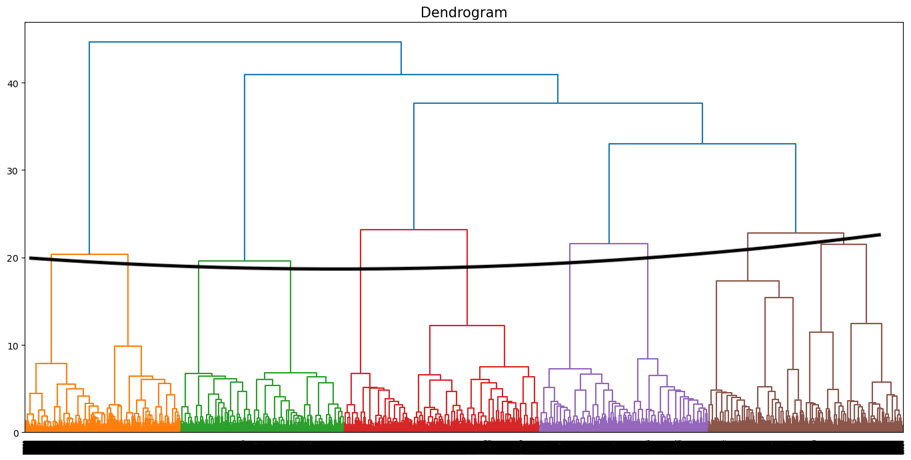

# Music Recommendation Algorithm

This dataset contains a mix of lyrical and continuous variables pulled from a 2020 research paper titled Music Dataset: Lyrics and Metadata from 1950 to 2019.

I apply unsupervised clustering algorithms to identify groupings within this the data from the songs. The goal is to create clusters that can accurately associate one song to another. This can be used to create music recomendations, or help find exactly the type of song you need for whatever mood you are in.

I apply two models, a K-means clustering model and a heirarchal clustering model:

The Kmeans model calculated the optimal number of clusters to be 6. This extremely general model led to most of our test data being classified into a single cluster.

The heirarchal clustering model performed much better, breaking down into 10 clusters shown at the  hypothetical cut below:

When applyed to the test data, it created an interesting mix among the values. The model classifyed Eso Beso(That Kiss) as a Love song while applying the label of a sad song to Your Cheating Heart. Picking up this kind of nuance is awesome, as I assume the second song has a lot of romantic themes as well. The other labels look to be properly applied as well.

The model is not perfect but I believe it can be an effective tool to help find a song for the mood you are in.

